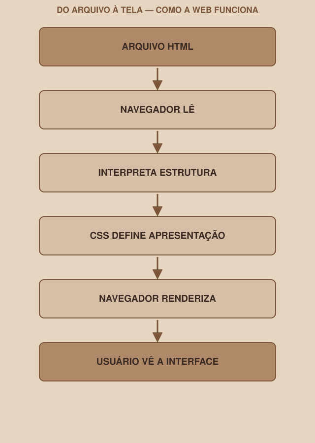

# Módulo 01 — Como a Web Funciona

`SEM 02 // Interface Web — Parte 1: Layout`

---

## // Antes do primeiro HTML

É tentador abrir um editor de código e começar a escrever tags direto. Mas antes disso vale responder uma pergunta que a maioria das pessoas nunca parou para fazer: o que exatamente acontece entre você criar um arquivo e uma pessoa ver uma página na tela?

Sem essa resposta, HTML e CSS parecem mágica. Com ela, cada módulo que vem depois faz sentido como peça de um mecanismo, não como truque decorado.

## // Navegador, site, página: desfazendo a confusão

> **CONCEITO — EM PALAVRAS SIMPLES**
> - **Navegador**: o programa que lê arquivos web e mostra o resultado na tela (Chrome, Firefox, Safari, Edge).
> - **Página**: um único arquivo HTML, com seu conteúdo e estrutura.
> - **Site**: um conjunto de páginas relacionadas (Login, Dashboard e Perfil, juntas, formam um site).
> - **Arquivo**: onde tudo isso vive fisicamente — `.html` para estrutura, `.css` para estilo.

## // Um servidor, em uma frase

Você não precisa entender servidores a fundo esta semana — isso é assunto de módulos futuros do clube. Mas o conceito mínimo importa:

> **SERVIDOR — EM PALAVRAS SIMPLES**
> Um servidor é um computador (geralmente longe do seu, ligado o tempo todo) que guarda arquivos e os envia quando alguém pede, através de um endereço (URL). Quando você digita `google.com`, seu navegador está pedindo arquivos para o servidor do Google.

## // Arquivo local × site na web

Existe uma diferença prática que você vai sentir nesta semana:

| | Arquivo local | Site na web |
|---|---|---|
| Onde está | No seu computador | Em um servidor |
| Como se acessa | Abrindo o arquivo direto (duplo clique, ou arrastar para o navegador) | Digitando uma URL |
| O que você vai fazer esta semana | Isto — abrir `login.html` localmente para testar | Isto vem em semanas futuras, quando o projeto for hospedado |

Nesta semana, todo o seu trabalho acontece em arquivos locais. Não existe endereço na internet ainda — e não precisa existir.

## // O papel do navegador

> **NAVEGADOR — EM PALAVRAS SIMPLES**
> O navegador é um programa que sabe ler arquivos HTML e CSS e transformar esse texto em algo visual, interativo, na tela.
>
> Tecnicamente: o navegador interpreta (faz o *parsing* de) o HTML, constrói uma representação em árvore do documento, aplica as regras CSS a essa árvore, e pinta o resultado na tela — processo chamado de renderização.

Veja o caminho completo:

Cada seta desse diagrama é um passo real, que acontece toda vez que uma página abre — inclusive nas que você vai criar esta semana.

## // HTML, CSS e JavaScript — os três papéis

Uma forma simples de fixar a diferença, só como ponto de partida:

> **ANALOGIA — SÓ COMO APOIO INICIAL**
> HTML é a estrutura de uma casa: paredes, cômodos, portas.
> CSS é o acabamento: cor da parede, tipo de piso, organização visual.
> JavaScript é o comportamento: a porta abrindo quando você aperta a campainha.

Essa analogia serve só para memorizar os três papéis — abandone ela a partir daqui e pense nos termos técnicos reais:

- **HTML** define **estrutura** — o que existe na página e o que cada parte significa.
- **CSS** define **apresentação** — como cada parte aparece visualmente.
- **JavaScript** define **comportamento** — o que acontece quando algo muda (um clique, uma digitação).

> **IMPORTANTE**
> JavaScript não é foco da Semana 02. Você vai ver a palavra algumas vezes, mas não vai escrever lógica de programação esta semana — só estrutura (HTML) e apresentação (CSS). Um botão pode existir, visualmente, sem nenhuma linha de JavaScript por trás.

## // Aplicando no projeto da semana

Antes de seguir para o Módulo 02, confirme o ambiente:

1. Escolha um editor de código para usar a semana inteira (VS Code é uma boa opção gratuita, mas qualquer editor de texto simples funciona para começar).
2. Crie uma pasta para o projeto, se ainda não tiver uma pasta clara vinda da Semana 01.
3. Dentro dela, crie um arquivo `teste.html` vazio e escreva só a palavra `Oi`.
4. Abra esse arquivo arrastando para dentro do navegador (ou duplo clique). Confirme: o navegador mostrou "Oi" na tela, mesmo sem nenhuma tag?

Isso confirma que o ambiente está funcionando — e mostra, na prática, que o navegador exibe qualquer conteúdo, mesmo sem estrutura. É exatamente esse "sem estrutura" que o próximo módulo resolve.

## // Checkpoint

> **ANTES DE SEGUIR, PENSE NISTO**
> Um colega diz: "não preciso aprender HTML, só uso Tailwind." O que essa frase ignora sobre o papel do navegador no processo que você acabou de ver?

Resposta: Tailwind gera CSS — ele resolve a etapa de apresentação. Mas o navegador ainda precisa de uma estrutura HTML para aplicar esse CSS em cima. Sem HTML, não existe "onde" o CSS (Tailwind incluso) atuar. Tailwind substitui escrever CSS manualmente, não substitui HTML.

## // Resumo do módulo

- [ ] Sei a diferença entre navegador, site e página.
- [ ] Sei explicar, em uma frase, o que é um servidor.
- [ ] Sei a diferença entre abrir um arquivo local e acessar um site pela web.
- [ ] Sei o caminho completo: arquivo → navegador lê → interpreta → CSS aplica → renderiza → usuário vê.
- [ ] Sei os três papéis: HTML (estrutura), CSS (apresentação), JavaScript (comportamento) — e sei que JS não é foco desta semana.
- [ ] Meu ambiente (editor + pasta do projeto) está pronto.

---

**Próximo módulo:** `02-html.md` — a primeira peça do mecanismo: como dar estrutura a um texto.

`Material de Estudo // Coffee & Code`
