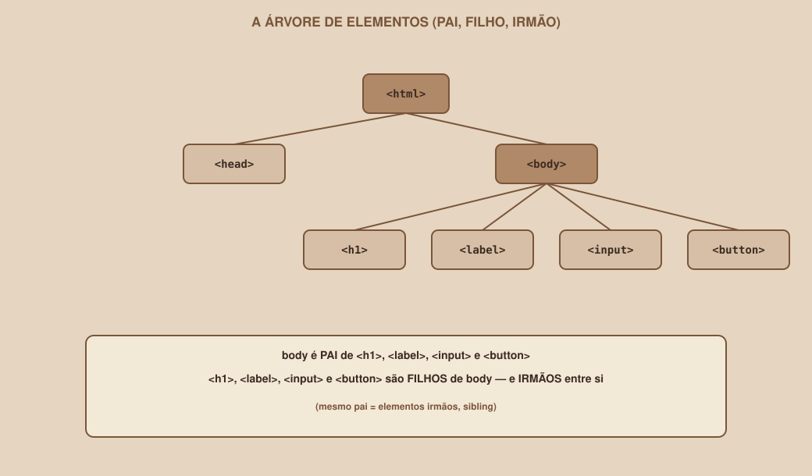

# Módulo 02 — HTML: Estrutura da Página

`SEM 02 // Interface Web — Parte 1: Layout`

---

## // Antes de começar

No Módulo 01 você viu o modelo geral: arquivo → navegador lê → interpreta estrutura → CSS define apresentação → navegador renderiza → você vê uma interface. Este módulo entra na primeira peça desse modelo: como a estrutura é escrita, de um jeito que o navegador consegue interpretar.

Vamos construir, ao longo do módulo, o começo da tela de **Login** do projeto-guia.

## // O problema: texto puro não tem significado nenhum

Imagine que você recebe, em um bloco de notas, isto:

```
Entrar

Email

Senha

Entrar
```

Isso é texto. Um navegador até consegue mostrar texto puro na tela — mas ele não faz ideia de que a primeira linha é um título, que "Email" e "Senha" são rótulos de campos que a pessoa deveria preencher, ou que o último "Entrar" é um botão clicável. Para o navegador, são só cinco linhas de texto, sem hierarquia, sem função, sem significado.

> **O PONTO PRINCIPAL**
> Sem uma forma de marcar o que cada parte do texto *é*, não existe diferença entre um título, um parágrafo e um botão — só letras na tela. É esse problema que o HTML resolve.

## // O que é HTML?

> **HTML — EM PALAVRAS SIMPLES**
> HTML é uma forma de "marcar" pedaços de um texto, dizendo ao navegador o que cada pedaço representa: isto é um título, isto é um parágrafo, isto é um botão.
>
> Tecnicamente: HTML (HyperText Markup Language) é uma linguagem de marcação — não uma linguagem de programação. Ela não calcula, não decide, não repete ações. Ela descreve a estrutura e o significado do conteúdo de uma página.

Vale parar no termo "linguagem de marcação", porque ele explica a diferença mais importante deste módulo. Uma linguagem de *programação* (como o JavaScript, que você vai encontrar em semanas futuras) dá instruções de comportamento: "se isso acontecer, faça aquilo". Uma linguagem de *marcação* não instrui comportamento — ela rotula conteúdo. HTML não sabe fazer nada sozinho; ele só diz "isto aqui é um título" e deixa o navegador decidir como mostrar um título.

## // Do texto puro ao HTML

Voltando ao exemplo de antes, veja o que acontece quando cada linha ganha uma marcação:

```html
<h1>Entrar</h1>

<label>Email</label>
<input type="email">

<label>Senha</label>
<input type="password">

<button>Entrar</button>
```

Nada do *conteúdo* mudou — ainda são as mesmas palavras. O que mudou é que agora cada pedaço carrega um significado explícito: `<h1>` diz "isto é o título mais importante da página", `<label>` diz "isto é o rótulo de um campo", `<input>` diz "isto é um campo onde a pessoa digita algo", `<button>` diz "isto é algo clicável que dispara uma ação". O navegador lê essas marcações e já sabe, sem adivinhar, como tratar cada parte.

## // Tag, elemento, conteúdo, atributo

Quatro termos que vão aparecer o tempo todo — melhor fixar agora, com um exemplo concreto:

```html
<label for="email">Email</label>
```

| Termo | O que é | Neste exemplo |
|---|---|---|
| Tag | A marcação em si, entre `<` e `>` | `<label>` (abertura) e `</label>` (fechamento) |
| Elemento | A tag de abertura + o conteúdo + a tag de fechamento, como um todo | `<label for="email">Email</label>` inteiro |
| Conteúdo | O que fica entre a abertura e o fechamento | `Email` |
| Atributo | Uma informação extra, escrita dentro da tag de abertura | `for="email"` |

Repare que a tag de fechamento é quase igual à de abertura, só com uma barra (`/`) antes do nome: `<label>` abre, `</label>` fecha. Esquecer de fechar uma tag é um dos erros mais comuns de quem está começando — o navegador tenta adivinhar onde ela deveria terminar, e o resultado raramente é o que você esperava.

Alguns elementos não têm conteúdo nem tag de fechamento separada — `<input type="email">`, por exemplo, é um elemento completo sozinho, porque um campo de formulário não "contém" texto entre uma abertura e um fechamento.

## // Nesting: elemento pai, filho e irmão

HTML raramente é uma lista plana de elementos — eles ficam uns dentro dos outros. Isso se chama *nesting* (aninhamento), e é a base de como uma página inteira se organiza.

<div align="center">

</div>

Três termos derivam diretamente dessa ideia de aninhamento:

- **Elemento pai** — um elemento que contém outro(s) dentro dele. No diagrama, `<body>` é pai de `<h1>`, `<label>`, `<input>` e `<button>`.
- **Elemento filho** — um elemento que está dentro de outro. `<h1>` é filho de `<body>`.
- **Elemento irmão (sibling)** — elementos que compartilham o mesmo pai. `<h1>`, `<label>`, `<input>` e `<button>` são todos irmãos entre si, porque todos são filhos diretos de `<body>`.

Essa relação de pai/filho/irmão não é só um detalhe de vocabulário — no Módulo 06 (Flexbox) e Módulo 07 (Grid), praticamente toda propriedade CSS de layout que você vai aprender atua exatamente nessa relação: um container (pai) organizando seus itens (filhos).

## // Indentação: por que a forma como você escreve importa

Indentação (os espaços no início de cada linha) não muda absolutamente nada para o navegador — ele lê o HTML sem se importar com espaços extras. Mas ela muda tudo para você e para qualquer pessoa que ler seu código depois:

```html
<!-- Difícil de ler: sem indentação, o aninhamento não aparece -->
<body>
<h1>Entrar</h1>
<label>Email</label>
<input type="email">
</body>

<!-- Fácil de ler: a indentação revela visualmente quem é filho de quem -->
<body>
  <h1>Entrar</h1>
  <label>Email</label>
  <input type="email">
</body>
```

A convenção mais comum é 2 espaços por nível de aninhamento. Editores de código costumam fazer isso automaticamente ao apertar Tab — mas vale entender que é uma convenção humana, não uma regra do navegador.

## // A estrutura mínima de uma página

Todo arquivo HTML começa com o mesmo esqueleto:

```html
<!DOCTYPE html>
<html lang="pt-BR">
<head>
  <meta charset="UTF-8">
  <meta name="viewport" content="width=device-width, initial-scale=1.0">
  <title>Login — Buscador de Grupos de Estudo</title>
</head>
<body>

</body>
</html>
```

Nada disso é decoração — cada linha existe por um motivo:

| Parte | O que faz |
|---|---|
| `<!DOCTYPE html>` | Avisa ao navegador que este documento usa o padrão HTML5 (a versão atual) |
| `<html lang="pt-BR">` | Elemento raiz — envolve todo o documento. `lang` informa o idioma, o que ajuda leitores de tela e tradutores automáticos |
| `<head>` | Guarda configurações e metadados que não aparecem como conteúdo visível da página |
| `<meta charset="UTF-8">` | Garante que acentos e caracteres do português (ã, ç, é) apareçam corretamente |
| `<meta name="viewport" ...>` | Avisa ao navegador do celular para não simular uma tela de desktop — fundamental para responsividade (Módulo 08) |
| `<title>` | Define o texto que aparece na aba do navegador |
| `<body>` | Contém tudo o que realmente aparece na página para quem está vendo |

Note que `<head>` e `<body>` são irmãos — os dois filhos diretos de `<html>` — e que **tudo o que uma pessoa vê** vive dentro de `<body>`. É lá que o restante deste módulo acontece.

## // Elementos essenciais, um de cada vez

### > Headings (títulos)

```html
<h1>Título principal</h1>
<h2>Um subtítulo</h2>
```

Existem seis níveis, `<h1>` até `<h6>`, do mais para o menos importante. Uma página deve ter só um `<h1>` — o título mais importante daquela tela — e os demais níveis organizam o conteúdo abaixo dele em ordem lógica, sem pular níveis (um `<h3>` não deveria aparecer sem um `<h2>` antes dele na mesma seção). Isso importa mais do que parece: leitores de tela usam esses níveis para navegar a página, então uma hierarquia bagunçada atrapalha diretamente a acessibilidade — assunto que volta com mais profundidade no Módulo 12.

### > Paragraphs (parágrafos)

```html
<p>Encontre colegas estudando a mesma matéria que você.</p>
```

### > Links

```html
<a href="cadastro.html">Ainda não tem conta? Cadastre-se</a>
```

`href` é um atributo — o endereço para onde o link leva.

### > Images

```html

```

`alt` não é opcional na prática: é o texto que aparece se a imagem não carregar, e o que um leitor de tela lê em voz alta para uma pessoa com deficiência visual. Uma imagem sem `alt` é uma imagem que simplesmente não existe para parte das pessoas que acessam sua página.

### > Lists

```html
<ul>
  <li>Cálculo I</li>
  <li>Estrutura de Dados</li>
</ul>
```

`<ul>` é uma lista sem ordem definida (marcadores); `<ol>` seria uma lista numerada. Cada item vive dentro de um `<li>`.

### > Buttons

```html
<button>Entrar</button>
```

## // Exemplo guiado: montando o topo do Login

Juntando o que vimos até aqui, dentro do `<body>` do arquivo de Login:

```html
<body>
  <h1>Entrar</h1>
  <p>Acesse sua conta para ver seus grupos de estudo.</p>
</body>
```

Isso já é uma página HTML válida — sem nenhum CSS, sem nenhum estilo, o navegador já sabe exibir um título grande seguido de um parágrafo. É pouco visualmente, mas é estruturalmente correto, e é exatamente esse tipo de correção que os próximos módulos (Formulários, depois CSS) constroem em cima.

## // Bom exemplo × mau exemplo

**Mau exemplo** — tudo é uma div, nada tem significado:

```html
<div>Entrar</div>
<div>Acesse sua conta para ver seus grupos de estudo.</div>
```

O navegador consegue exibir isso, mas perdeu toda a informação sobre o que cada linha *é*. Visualmente talvez pareça igual depois de aplicar CSS — mas semanticamente essas duas linhas viraram texto genérico, indistinguível uma da outra para qualquer ferramenta (leitor de tela, mecanismo de busca) que dependa de significado, não só de aparência.

**Bom exemplo** — cada linha carrega seu próprio significado:

```html
<h1>Entrar</h1>
<p>Acesse sua conta para ver seus grupos de estudo.</p>
```

Vamos aprofundar exatamente esse ponto — `<div>` genérica × elemento com significado — no Módulo 03, quando HTML semântico entra em cena.

## // Erros comuns

| Erro | Por que acontece | Como corrigir |
|---|---|---|
| Esquecer a tag de fechamento | Fácil de perder em elementos com bastante conteúdo dentro | Sempre feche na mesma hora que abrir, antes de preencher o conteúdo |
| Aninhar tags fora de ordem (`<p><h1>...</p></h1>`) | Digitar rápido sem prestar atenção à ordem | Feche as tags na ordem inversa da abertura — a última aberta é a primeira a fechar |
| Usar `<div>` para tudo | Parece mais simples não pensar em qual elemento usar | Pergunte "o que isto *é*?" antes de escrever a tag |
| Esquecer `alt` em imagens | Não pensar em quem usa leitor de tela | Trate `alt` como parte obrigatória de toda tag `` |
| Pular níveis de heading (`<h1>` direto para `<h4>`) | Escolher o tamanho pelo visual, não pela hierarquia | Escolha o nível pela importância lógica; ajuste o tamanho depois, com CSS |

## // Prática guiada

Vamos montar, juntos, o esqueleto completo da página de Login.

1. Crie um arquivo chamado `login.html`.
2. Adicione a estrutura mínima (`<!DOCTYPE html>` até `</html>`), com o `<title>` "Login — Buscador de Grupos de Estudo".
3. Dentro do `<body>`, adicione um `<h1>` com o texto "Entrar".
4. Logo abaixo, adicione um `<p>` explicando brevemente o que a tela faz.
5. Adicione um `<a>` com um link para uma futura página de cadastro (o destino pode ser `cadastro.html`, mesmo que esse arquivo ainda não exista).
6. Salve e abra o arquivo diretamente no navegador (arraste o arquivo para uma aba, ou dê duplo clique nele).
7. Confirme: o título aparece na aba do navegador? O `<h1>` aparece maior que o `<p>`? O link aparece sublinhado e azul (estilo padrão do navegador, sem nenhum CSS ainda)?

## // Pratique sozinho

> **DESAFIO**
> Crie um segundo arquivo, `cadastro.html`, com a mesma estrutura mínima. Dentro do `<body>`, adicione um `<h1>` "Criar conta", um `<p>` breve, e um link `<a>` de volta para `login.html`. No final, clique no link de `login.html` para `cadastro.html` e vice-versa, confirmando que a navegação entre os dois arquivos funciona.

## // Aplicando no projeto da semana

1. No repositório do seu projeto, crie a pasta `pages/` (ou use a raiz, se preferir uma estrutura mais simples por enquanto).
2. Crie `login.html` com a estrutura que você praticou acima, usando o texto e os elementos que fizerem sentido para a tela de Login do *seu* protótipo do Figma — não precisa ser idêntico ao Buscador de Grupos de Estudo.
3. Faça o mesmo raciocínio (sem copiar ainda o CSS, que vem no Módulo 04) para pelo menos o título e um parágrafo inicial das telas de Dashboard e Perfil.
4. Commit: `git add .` e `git commit -m "Adiciona estrutura HTML inicial das três telas"`.

## // Checkpoint

> **ANTES DE SEGUIR, PENSE NISTO**
> Você tem este trecho de HTML:
> ```html
> <section>
>   <h2>Meus grupos</h2>
>   <p>Você está em 3 grupos.</p>
> </section>
> ```
> Quem é pai de quem aqui? E quem são irmãos entre si?

Resposta: `<section>` é pai de `<h2>` e de `<p>`. `<h2>` e `<p>` são filhos diretos de `<section>` — e, por compartilharem o mesmo pai, são irmãos entre si.

## // Resumo do módulo

- [ ] Sei explicar o que significa "linguagem de marcação", e por que HTML não é uma linguagem de programação.
- [ ] Sei a diferença entre tag, elemento, conteúdo e atributo.
- [ ] Sei o que significa elemento pai, filho e irmão, e por que isso importa para os próximos módulos.
- [ ] Sei montar a estrutura mínima de um arquivo HTML e explicar cada parte dela.
- [ ] Sei usar headings, parágrafos, links, imagens, listas e botões.
- [ ] Tenho pelo menos o esqueleto HTML das três telas do meu projeto.

---

**Próximo módulo:** `03-html-semantico-e-formularios.md` — `<div>` funciona, mas quase nunca é a escolha certa. Hora de aprender por quê.

`Material de Estudo // Coffee & Code`
