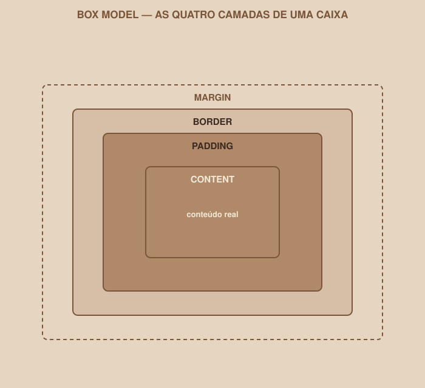

# Módulo 05 — Box Model, Tamanhos e Espaçamento

`SEM 02 // Interface Web — Parte 1: Layout`

---

## // O problema

Você define `width: 300px` em um elemento, adiciona um `padding` de 20px e uma `border` de 2px — e o elemento final não tem 300px de largura. Ele tem mais. Isso confunde praticamente todo mundo que começa com CSS, e a razão tem um nome: Box Model.

## // Todo elemento é uma caixa

> **BOX MODEL — EM PALAVRAS SIMPLES**
> O navegador trata praticamente todo elemento HTML como uma caixa retangular, composta por quatro camadas, uma dentro da outra: conteúdo, espaçamento interno, borda e espaçamento externo.

<div align="center">

</div>

| Camada | O que é |
|---|---|
| `content` | O conteúdo em si — texto, imagem — e as dimensões definidas por `width`/`height` |
| `padding` | Espaço interno, entre o conteúdo e a borda |
| `border` | O contorno da caixa |
| `margin` | Espaço externo, que afasta essa caixa das caixas vizinhas |

## // Padding × margin: a confusão mais comum

Os dois criam espaço, mas em lugares opostos:

- **Padding** empurra o conteúdo para *dentro* da própria caixa — aumenta a caixa, mantendo distância entre o conteúdo e a borda.
- **Margin** empurra a caixa inteira para *longe* de outras caixas — não afeta o tamanho da caixa em si, afeta o espaço ao redor dela.

```css
.card {
    padding: 20px;  /* espaço entre a borda do card e o texto dentro dele */
    margin: 16px;   /* espaço entre este card e o próximo elemento */
}
```

## // O cálculo que confunde todo mundo

```css
.card {
    width: 300px;
    padding: 20px;
    border: 2px solid;
}
```

Por padrão, o navegador calcula `width` considerando **só o content**. Então o tamanho final visível dessa caixa é:

```
300px (content) + 20px + 20px (padding, dos dois lados) + 2px + 2px (border, dos dois lados)
= 344px de largura total
```

Ou seja: `width: 300px` não significa "esta caixa vai ocupar 300px" — significa "o conteúdo vai ter 300px, e padding/border se somam por cima".

## // `box-sizing: border-box`

```css
* {
    box-sizing: border-box;
}
```

Essa declaração muda a regra do cálculo: com `border-box`, o `width` passa a representar o tamanho **final** da caixa, já incluindo padding e border. No exemplo anterior, com `border-box`, a caixa teria exatamente 300px — o navegador reduz o espaço disponível para o conteúdo automaticamente, para caber padding e border dentro dos 300px.

> **POR QUE USAR `BORDER-BOX`**
> Com `border-box`, o tamanho que você escreve é o tamanho que você recebe — muito mais previsível ao montar um layout. É por isso que praticamente todo projeto profissional começa o CSS com essa regra aplicada a `*` (todos os elementos), logo no topo do arquivo.

## // Tamanhos e unidades

Nem todo número em CSS significa "pixels". Cada unidade resolve um problema diferente:

| Unidade | Resolve | Exemplo |
|---|---|---|
| `px` | Tamanho fixo, exato | `border: 1px solid;` |
| `%` | Tamanho relativo ao espaço disponível do elemento pai | `width: 100%;` — ocupa toda a largura disponível |
| `rem` | Tamanho relativo ao tamanho de fonte base da página | `font-size: 1.5rem;` — escala junto se a base mudar |
| `em` | Tamanho relativo ao tamanho de fonte do próprio elemento | Usado com cautela — pode compor de forma inesperada em elementos aninhados |
| `vw` / `vh` | Porcentagem da largura/altura da **tela** (viewport) | `height: 100vh;` — ocupa a altura inteira da tela |
| `fr` | Fração do espaço disponível — só existe dentro de Grid | Volta com detalhe no Módulo 07 |

> **QUANDO CADA UNIDADE PODE CAUSAR PROBLEMA**
> `px` fixo demais para textos — não respeita configurações de acessibilidade do navegador da pessoa. `%` depende inteiramente do elemento pai ter um tamanho definido — sem isso, o resultado é imprevisível. `vh` em celulares pode se comportar de forma inconsistente por causa das barras do navegador mobile. Não existe unidade "certa" universal — existe a unidade certa para cada situação, e você vai desenvolver esse instinto com a prática.

Para tamanho de fonte e espaçamento, `rem` costuma ser a escolha mais segura — é o padrão que vamos usar no design system em código, no Módulo 11.

## // Bom exemplo × mau exemplo

**Mau exemplo** — tamanhos imprevisíveis, sem `border-box`:

```css
.card {
    width: 300px;
    padding: 24px;
    border: 3px solid;
    /* tamanho final real: 300 + 24*2 + 3*2 = 354px, não 300px */
}
```

**Bom exemplo** — previsível, com `border-box` global:

```css
* {
    box-sizing: border-box;
}

.card {
    width: 300px;
    padding: 24px;
    border: 3px solid;
    /* tamanho final real: exatamente 300px */
}
```

## // Erros comuns

| Erro | Por que acontece | Como corrigir |
|---|---|---|
| Esquecer `box-sizing: border-box` | Não é o padrão do navegador | Adicione `* { box-sizing: border-box; }` logo no topo do CSS |
| Confundir padding com margin ao espaçar elementos | Os dois "criam espaço" | Pergunte: quero espaço *dentro* da caixa (padding) ou *entre* caixas (margin)? |
| Misturar `px` para tudo | Parece mais simples no começo | Considere `rem` para fontes e espaçamentos, reservando `px` para bordas finas |
| Elemento "maior que devia" | `width` sem `border-box`, somando padding/border | Confira se `box-sizing: border-box` está aplicado |

## // Prática guiada

1. No `styles.css`, adicione `* { box-sizing: border-box; }` como a primeira regra do arquivo.
2. No formulário de Login, adicione `padding` aos campos (`input`) para que o texto digitado não fique colado na borda.
3. Adicione `margin-bottom` entre os campos, para que não fiquem colados um no outro.
4. Experimente remover temporariamente o `box-sizing: border-box` e observe visualmente a diferença no tamanho dos elementos — depois coloque de volta.

## // Pratique sozinho

> **DESAFIO**
> Escolha um card do Dashboard (mesmo que ainda simples) e defina explicitamente: `width`, `padding`, `border` e `margin`. Calcule manualmente, no papel, qual seria o tamanho final da caixa sem `border-box`, e confirme com o DevTools do navegador (clique com o botão direito sobre o elemento → Inspecionar) se o valor calculado bate com a sua conta.

## // Aplicando no projeto da semana

1. Garanta que `box-sizing: border-box` está no topo do `styles.css` do projeto.
2. Revise o espaçamento (padding e margin) dos elementos principais das três telas, usando uma escala consistente (por exemplo, múltiplos de 4 ou 8, como já definido no design system da Semana 01).
3. Commit: `git commit -m "Aplica Box Model e escala de espaçamento consistente"`.

## // Checkpoint

> **ANTES DE SEGUIR, PENSE NISTO**
> Seu botão tem `width: 200px`, `padding: 20px` e `border: 2px`. Com `box-sizing: content-box` (o padrão do navegador), ele realmente ocupa apenas 200px? Explique.

Resposta: não. Com `content-box` (o padrão), `width` define só a área de conteúdo — padding e border se somam por fora. O tamanho final seria 200 + 20×2 + 2×2 = 244px. Só com `box-sizing: border-box` os 200px passariam a representar o tamanho total da caixa.

## // Resumo do módulo

- [ ] Sei nomear as quatro camadas do Box Model, de dentro para fora.
- [ ] Sei explicar a diferença entre padding e margin sem hesitar.
- [ ] Sei calcular o tamanho final de uma caixa, com e sem `border-box`.
- [ ] Sei quando usar `px`, `%`, `rem` e `vw`/`vh`, e por que cada uma existe.
- [ ] O CSS do meu projeto já tem `box-sizing: border-box` aplicado globalmente.

---

**Próximo módulo:** `06-flexbox.md` — três botões teimam em ficar empilhados. Hora de controlar como os elementos se distribuem.

`Material de Estudo // Coffee & Code`
