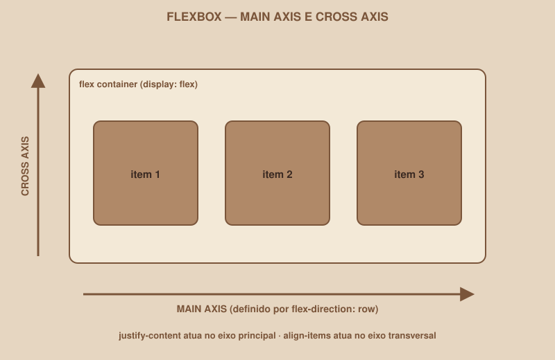

# Módulo 06 — Flexbox

`SEM 02 // Interface Web — Parte 1: Layout`

---

## // O problema

Você tem três botões no HTML:

```html
<button>Cancelar</button>
<button>Salvar rascunho</button>
<button>Entrar</button>
```

Por padrão, cada um ocupa sua própria linha, empilhados verticalmente — é assim que o navegador organiza elementos como `<button>` naturalmente, um embaixo do outro. Mas você quer:

```
[ Cancelar ] [ Salvar rascunho ] [ Entrar ]
```

Lado a lado. Como controlar isso?

## // A ideia por trás da solução

Precisamos de uma forma de controlar como os elementos filhos são distribuídos dentro de um elemento pai — a direção deles, o espaço entre eles, o alinhamento. É exatamente isso que o Flexbox resolve.

## // O que é Flexbox

> **FLEXBOX — EM PALAVRAS SIMPLES**
> Flexbox é um modo de layout do CSS que organiza os filhos diretos de um elemento em uma única direção — linha ou coluna — controlando como esse espaço é distribuído entre eles.

## // Container, items, e os dois eixos

Três termos aparecem em toda propriedade de Flexbox:

- **Flex container** — o elemento pai, onde você ativa o Flexbox.
- **Flex items** — os filhos diretos desse container, organizados por ele.
- **Main axis (eixo principal)** e **Cross axis (eixo transversal)** — as duas direções que o Flexbox entende, perpendiculares entre si.

<div align="center">

</div>

O eixo principal depende da direção que você escolhe (`flex-direction`) — se for `row` (linha, o padrão), o eixo principal é horizontal. Se for `column`, o eixo principal vira vertical, e o transversal, horizontal.

## // Ativando o Flexbox

```css
.barra-botoes {
    display: flex;
}
```

Só essa linha já resolve o problema inicial: os `<button>` que eram filhos diretos de `.barra-botoes` passam a ficar lado a lado, automaticamente.

## // As propriedades, uma de cada vez

### > `flex-direction`

```css
.barra-botoes {
    display: flex;
    flex-direction: row; /* padrão — pode ser omitido */
}
```

`row` organiza na horizontal (o padrão); `column` organiza na vertical, como uma pilha — mas diferente do empilhamento natural do HTML, agora você controla o espaçamento e alinhamento entre os itens.

### > `justify-content` — alinhamento no eixo principal

```css
.barra-botoes {
    display: flex;
    justify-content: space-between;
}
```

Controla como os itens se distribuem ao longo do eixo principal. Valores comuns: `flex-start` (início), `center` (centro), `flex-end` (fim), `space-between` (espaço igual *entre* os itens, sem espaço nas pontas), `space-around` (espaço igual ao redor de cada item).

### > `align-items` — alinhamento no eixo transversal

```css
.barra-botoes {
    display: flex;
    align-items: center;
}
```

Mesma lógica de `justify-content`, mas no eixo transversal. Em uma barra horizontal (`flex-direction: row`), `align-items: center` centraliza os itens verticalmente dentro do container.

### > `gap`

```css
.barra-botoes {
    display: flex;
    gap: 16px;
}
```

Espaço fixo entre os itens — sem precisar de `margin` manual em cada um, e sem o risco de sobrar margin extra na primeira ou última posição.

### > `flex-wrap`

```css
.barra-botoes {
    display: flex;
    flex-wrap: wrap;
}
```

Por padrão, o Flexbox tenta espremer todos os itens em uma linha só, mesmo que fique apertado. `flex-wrap: wrap` permite que os itens quebrem para a próxima linha quando não couberem — importante para responsividade (Módulo 08).

### > `flex-grow` e `flex-shrink` — aprofundamento

```css
.busca {
    flex-grow: 1; /* ocupa todo o espaço restante disponível */
}
```

`flex-grow` controla o quanto um item cresce para ocupar espaço extra disponível; `flex-shrink` controla o quanto ele encolhe quando falta espaço. Você não precisa dominar os dois agora — eles aparecem quando um item específico precisa se comportar diferente dos seus irmãos (por exemplo, um campo de busca que deveria esticar, enquanto um botão ao lado mantém tamanho fixo).

## // Antes e depois, em cada propriedade

```css
/* ANTES — sem Flexbox */
.navbar { }
/* logo e links empilhados, um embaixo do outro */

/* DEPOIS — com Flexbox */
.navbar {
    display: flex;
    justify-content: space-between;
    align-items: center;
}
/* logo à esquerda, links à direita, tudo alinhado verticalmente ao centro */
```

## // Onde usar Flexbox no seu projeto

- **Navbar** — logo de um lado, ações do outro.
- **Formulário** — campos empilhados em coluna (`flex-direction: column`).
- **Linha de botões** — vários botões lado a lado, com espaçamento uniforme.
- **Avatar + informações** — imagem e texto alinhados lado a lado, centralizados verticalmente.

## // Erros comuns

| Erro | Por que acontece | Como corrigir |
|---|---|---|
| `display: flex` no elemento errado | Aplicar nos filhos em vez do pai | Flexbox é ativado no **container**, e organiza os **filhos diretos** dele |
| Esperar que `justify-content` alinhe verticalmente em uma linha horizontal | Confundir eixo principal com transversal | `justify-content` é sempre o eixo principal; use `align-items` para o transversal |
| Itens não quebram de linha em telas pequenas | Esquecer `flex-wrap` | Adicione `flex-wrap: wrap` quando os itens puderem precisar de mais de uma linha |
| Usar Flexbox para tudo, inclusive grades 2D | Não conhecer Grid ainda | Módulo 07 resolve exatamente esse caso |

## // Checkpoint intermediário

> **PENSE NISTO ANTES DE SEGUIR**
> Se `flex-direction: column`, qual eixo `justify-content` controla agora — o vertical ou o horizontal?

Resposta: o vertical. O eixo principal muda junto com `flex-direction` — em `column`, o eixo principal passa a ser vertical, então `justify-content` (que sempre atua no eixo principal) passa a controlar o alinhamento vertical, e `align-items` passa a controlar o horizontal.

## // Prática guiada

1. No `styles.css`, crie uma classe `.navbar` com `display: flex`, `justify-content: space-between` e `align-items: center`.
2. Aplique essa classe ao elemento que envolve o logo e os links de navegação do Dashboard.
3. Crie uma classe `.form-login` com `display: flex` e `flex-direction: column`, aplicada ao `<form>` do Login — isso empilha os campos verticalmente, com controle total do espaçamento via `gap`.
4. Adicione `gap: 16px` a essa classe, e remova qualquer `margin-bottom` manual que você tenha colocado nos campos no Módulo 05.

## // Pratique sozinho

> **DESAFIO**
> Na tela de Perfil, organize o avatar e as informações do usuário (nome, e-mail) lado a lado usando Flexbox — avatar à esquerda, texto à direita, alinhados verticalmente ao centro. Depois, organize os botões de ação ("Editar perfil", "Sair") em uma linha separada, com `gap` entre eles.

## // Aplicando no projeto da semana

1. Use Flexbox na navbar/header das três telas, para alinhamento consistente.
2. Use Flexbox no formulário de Login, para empilhar os campos com espaçamento uniforme.
3. Use Flexbox em qualquer linha de botões do seu projeto.
4. Commit: `git commit -m "Aplica Flexbox na navbar, formulário e linhas de botões"`.

## // Checkpoint

> **ANTES DE SEGUIR, PENSE NISTO**
> Sua navbar tem o logo à esquerda e um grupo de links à direita. Flexbox ou Grid parece mais natural aqui? Justifique.

Resposta: Flexbox — é um problema de organização em uma única dimensão (uma linha horizontal), exatamente o que Flexbox resolve. Grid entra quando o problema é bidimensional (linhas *e* colunas ao mesmo tempo), como veremos no próximo módulo com os cards do Dashboard.

## // Resumo do módulo

- [ ] Sei o que é um flex container e um flex item.
- [ ] Sei a diferença entre main axis e cross axis, e como ela muda com `flex-direction`.
- [ ] Sei usar `justify-content`, `align-items` e `gap` para resolver alinhamentos comuns.
- [ ] Sei quando adicionar `flex-wrap`.
- [ ] A navbar, o formulário de Login e pelo menos uma linha de botões do meu projeto já usam Flexbox.

---

**Próximo módulo:** `07-grid.md` — Flexbox organiza uma linha. E quando o problema tem duas dimensões, como o grid de cards do Dashboard?

`Material de Estudo // Coffee & Code`
