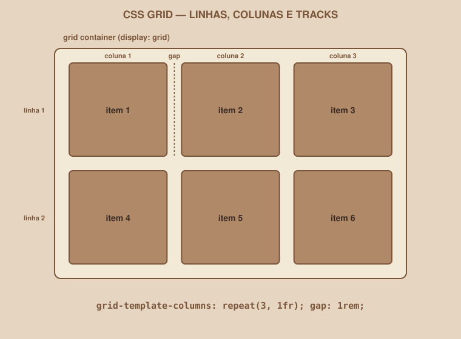
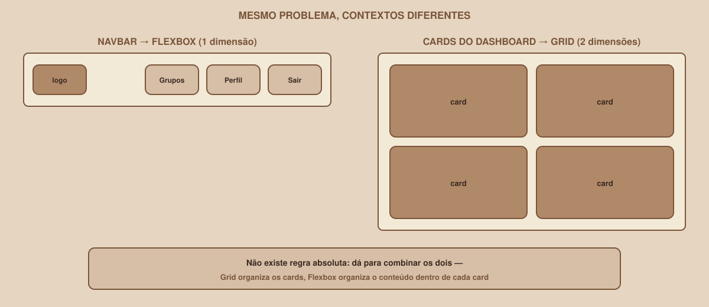

# Módulo 07 — CSS Grid

`SEM 02 // Interface Web — Parte 1: Layout`

---

## // Antes de começar

Este módulo assume que o Módulo 06 (Flexbox) já está claro. Grid resolve um problema diferente — e a diferença só faz sentido depois de ter sentido, na prática, o que Flexbox resolve.

## // O problema

O Dashboard do seu projeto precisa mostrar vários cards de grupos de estudo, organizados em linhas *e* colunas ao mesmo tempo:

```
[ Card ] [ Card ] [ Card ]
[ Card ] [ Card ] [ Card ]
```

Dá para tentar forçar isso com Flexbox (`flex-wrap: wrap`), e às vezes até funciona razoavelmente. Mas Flexbox foi pensado para organizar em **uma** dimensão por vez — ele não tem um conceito nativo de "esta linha e aquela linha abaixo devem ter colunas alinhadas entre si". Para uma estrutura genuinamente bidimensional, existe uma ferramenta feita exatamente para isso.

## // O que é CSS Grid

> **GRID — EM PALAVRAS SIMPLES**
> Grid é um modo de layout do CSS que organiza os filhos de um elemento em linhas e colunas ao mesmo tempo, como uma grade — diferente do Flexbox, que organiza em uma única direção.

## // Grid container, grid items, tracks

- **Grid container** — o elemento pai, onde você ativa o Grid.
- **Grid items** — os filhos diretos, posicionados dentro da grade.
- **Tracks** — cada linha ou coluna da grade é chamada de *track*.

<div align="center">

</div>

## // Ativando o Grid

```css
.dashboard-grid {
    display: grid;
    grid-template-columns: repeat(3, 1fr);
    gap: 1rem;
}
```

Vamos decompor cada parte:

| Parte | O que faz |
|---|---|
| `display: grid` | Ativa o modo Grid neste elemento |
| `grid-template-columns` | Define quantas colunas existem, e o tamanho de cada uma |
| `repeat(3, 1fr)` | Atalho para "3 colunas, cada uma ocupando uma fração igual do espaço" — equivalente a escrever `1fr 1fr 1fr` |
| `1fr` | Uma unidade nova, exclusiva do Grid: uma *fração* do espaço disponível |
| `gap: 1rem` | Espaço entre as colunas e entre as linhas, de uma vez |

Repare que você não precisa dizer nada sobre linhas neste exemplo — o Grid cria automaticamente quantas linhas forem necessárias para encaixar os itens, respeitando as 3 colunas definidas.

## // `fr`: a unidade que só existe em Grid

```css
grid-template-columns: 2fr 1fr;
```

Isso cria duas colunas, onde a primeira ocupa o dobro do espaço da segunda — proporcional, não em pixels fixos. `fr` sempre divide o espaço *disponível* proporcionalmente, parecido com `flex-grow` no Flexbox, mas pensado para colunas e linhas inteiras.

## // `minmax()` — aprofundamento

```css
grid-template-columns: repeat(3, minmax(200px, 1fr));
```

`minmax(200px, 1fr)` diz: cada coluna deve ter no mínimo 200px, mas pode crescer até `1fr` se houver espaço. Isso evita que colunas fiquem espremidas demais em telas menores — um primeiro passo para pensar em Grid responsivo, que aprofundamos no Módulo 08.

## // `auto-fit` / `auto-fill` — aprofundamento

```css
grid-template-columns: repeat(auto-fit, minmax(200px, 1fr));
```

Em vez de um número fixo de colunas, `auto-fit` deixa o navegador calcular quantas colunas cabem, respeitando o tamanho mínimo de `minmax()` — o número de colunas se ajusta automaticamente conforme a tela fica mais larga ou mais estreita, sem precisar de uma media query para isso.

## // Flexbox × Grid, lado a lado

<div align="center">

</div>

"Flex é 1D, Grid é 2D" é verdade, mas sozinho não explica muito. Na prática:

- **Flexbox** — quando você está organizando uma sequência de itens em uma linha ou coluna, onde o tamanho de cada item pode variar naturalmente conforme o conteúdo.
- **Grid** — quando você precisa de uma estrutura onde linhas *e* colunas importam ao mesmo tempo, com itens alinhados em ambas as direções.

> **NÃO EXISTE REGRA ABSOLUTA**
> Os dois podem — e costumam — ser combinados no mesmo projeto: Grid organiza os cards do Dashboard (a grade inteira), e Flexbox organiza o conteúdo *dentro* de cada card individual (o título, a descrição e o botão, alinhados em uma coluna). Um não substitui o outro; eles resolvem níveis diferentes do mesmo layout.

## // Bom exemplo × mau exemplo

**Mau exemplo** — forçando Flexbox para um grid genuíno:

```css
.dashboard-grid {
    display: flex;
    flex-wrap: wrap;
}
.card {
    width: 32%; /* cálculo manual frágil, quebra fácil com gap */
}
```

**Bom exemplo** — Grid para o que é genuinamente bidimensional:

```css
.dashboard-grid {
    display: grid;
    grid-template-columns: repeat(3, 1fr);
    gap: 1rem;
}
```

## // Erros comuns

| Erro | Por que acontece | Como corrigir |
|---|---|---|
| `display: grid` sem `grid-template-columns` | Esquecer de definir a estrutura de colunas | Sem isso, o Grid cria uma única coluna — defina explicitamente |
| Conteúdo do card "estourando" a célula | Elemento interno maior que o espaço disponível | Confira `min-width`/`max-width` do conteúdo, ou use `overflow` conscientemente |
| Confundir `fr` com porcentagem | Os dois "dividem espaço" | `fr` divide o espaço restante *depois* de descontar `gap` e itens de tamanho fixo — mais previsível que `%` em grids |
| Usar Grid para uma navbar simples | Achar que Grid é sempre "melhor" por ser mais novo | Uma linha de itens é Flexbox — reserve Grid para estruturas genuinamente 2D |

## // Prática guiada

1. No `styles.css`, crie uma classe `.dashboard-grid` com `display: grid`, `grid-template-columns: repeat(3, 1fr)` e `gap: 1rem`.
2. Aplique essa classe ao elemento que envolve os cards de grupos no Dashboard.
3. Dentro de cada `.card`, use Flexbox (`display: flex; flex-direction: column;`) para organizar título, descrição e botão em uma coluna, com `gap`.
4. Observe: a grade externa (Grid) e a organização interna de cada card (Flexbox) estão resolvendo problemas diferentes, ao mesmo tempo.

## // Pratique sozinho

> **DESAFIO**
> Experimente trocar `grid-template-columns: repeat(3, 1fr)` por `repeat(auto-fit, minmax(220px, 1fr))` no seu Dashboard. Redimensione a janela do navegador (ou o preview, se seu editor tiver um) e observe: quantas colunas aparecem em diferentes larguras, sem nenhuma media query escrita?

## // Aplicando no projeto da semana

1. Use Grid para o grid de cards do Dashboard.
2. Use Flexbox dentro de cada card, para organizar o conteúdo interno.
3. Revise: existe algum outro lugar do seu projeto que é genuinamente bidimensional (por exemplo, uma grade de interesses no Perfil)? Aplique Grid lá também.
4. Commit: `git commit -m "Aplica CSS Grid no dashboard de cards"`.

## // Checkpoint

> **ANTES DE SEGUIR, PENSE NISTO**
> O Dashboard tem seis cards, organizados em duas dimensões (linhas e colunas). Qual ferramenta de layout parece mais natural — Flexbox ou Grid — e por quê?

Resposta: Grid. O problema é genuinamente bidimensional — alinhar itens tanto em linhas quanto em colunas simultaneamente é exatamente o que Grid foi desenhado para fazer, com `grid-template-columns` controlando a estrutura de colunas e o navegador cuidando automaticamente das linhas.

## // Resumo do módulo

- [ ] Sei o que são grid container, grid items e tracks.
- [ ] Sei usar `grid-template-columns`, `repeat()`, `fr` e `gap`.
- [ ] Sei explicar, com um exemplo, quando usar Flexbox e quando usar Grid.
- [ ] Sei que os dois podem se combinar no mesmo layout, em níveis diferentes.
- [ ] O grid de cards do Dashboard do meu projeto usa CSS Grid.

---

**Próximo módulo:** `08-responsividade.md` — seu layout está ótimo no desktop. Bora ver o que acontece no celular.

`Material de Estudo // Coffee & Code`
