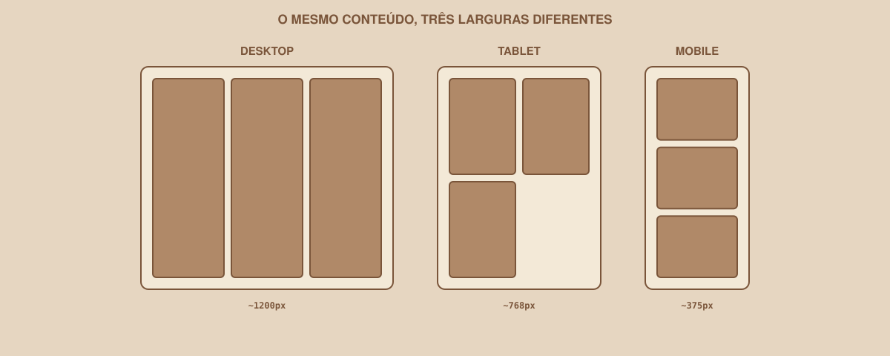
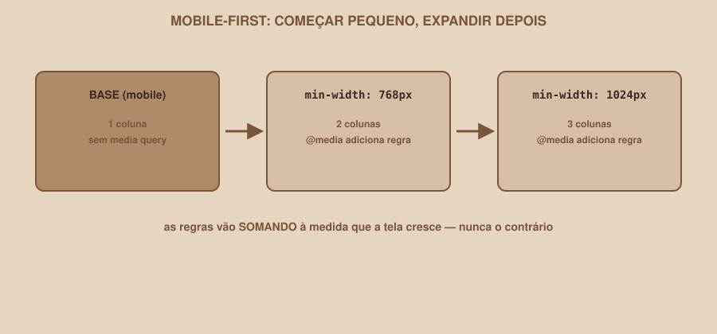

# Módulo 08 — Responsividade

`SEM 02 // Interface Web — Parte 1: Layout`

---

## // O problema

Seu Dashboard está com três colunas de cards, bonito no monitor do seu computador. Agora diminua a janela do navegador até a largura de um celular (~375px). O que acontece?

```
Desktop:  [ CARD ][ CARD ][ CARD ]
Celular:  [ CARD ][ CA][RD ][ CAR]
```

Os cards espremem, o texto quebra estranho, talvez apareça uma barra de rolagem horizontal. O layout que funcionava perfeitamente em uma largura simplesmente não funciona em outra.

## // O que significa responsividade

> **RESPONSIVIDADE — EM PALAVRAS SIMPLES**
> É a capacidade de um layout se adaptar a diferentes tamanhos de tela, mantendo a interface utilizável em qualquer um deles — sem depender de criar uma versão separada da página para cada dispositivo.

<div align="center">

</div>

## // Viewport

> **VIEWPORT — EM PALAVRAS SIMPLES**
> É a área visível da tela onde a página é exibida — o tamanho da janela do navegador, ou da tela do celular.

Você já usou essa palavra no Módulo 02, na tag `<meta name="viewport">`. Ela existe justamente para avisar o navegador do celular: "não simule uma tela de desktop reduzida, use a largura real do dispositivo." Sem essa meta tag, a responsividade que este módulo ensina simplesmente não funciona em celulares de verdade.

## // Breakpoint

> **BREAKPOINT — EM PALAVRAS SIMPLES**
> É uma largura de tela específica a partir da qual o layout muda de comportamento, porque o layout anterior deixou de funcionar bem.

Um breakpoint não é um número mágico que você decora de uma lista — ele nasce de um processo:

1. Reduza a largura da janela do navegador, olhando seu layout.
2. Observe em que ponto ele começa a quebrar (texto espremido, cards minúsculos, elementos sobrepostos).
3. Decida ali, naquele ponto específico, como o layout deveria se adaptar.
4. Crie uma regra CSS para essa largura.

## // Media query

```css
@media (max-width: 768px) {
    .dashboard-grid {
        grid-template-columns: repeat(2, 1fr);
    }
}
```

Essa regra diz: "quando a largura da tela for 768px ou menos, aplique estas regras por cima das regras normais." O CSS dentro do `@media` só é considerado quando a condição é verdadeira.

## // Mobile-first

<div align="center">

</div>

> **MOBILE-FIRST — EM PALAVRAS SIMPLES**
> É escrever o CSS base pensando primeiro na tela pequena (sem nenhuma media query), e depois usar `min-width` para *adicionar* regras conforme a tela cresce — em vez do caminho contrário.

```css
/* Base: já pensada para mobile, sem media query nenhuma */
.dashboard-grid {
    display: grid;
    grid-template-columns: 1fr;
    gap: 1rem;
}

/* A partir de 768px, adiciona 2 colunas */
@media (min-width: 768px) {
    .dashboard-grid {
        grid-template-columns: repeat(2, 1fr);
    }
}

/* A partir de 1024px, adiciona 3 colunas */
@media (min-width: 1024px) {
    .dashboard-grid {
        grid-template-columns: repeat(3, 1fr);
    }
}
```

Repare na lógica: as regras vão **somando** conforme a tela cresce, nunca no sentido contrário. Isso tende a gerar CSS mais simples de acompanhar do que começar pelo desktop e ir "desfazendo" regras para telas menores.

## // Responsividade não é só "diminuir tudo"

Um erro comum de quem está começando é pensar em responsividade como "deixar tudo menor". Na prática, ela pode significar:

- Mudar o **número de colunas** (3 cards → 2 → 1).
- **Reorganizar** o conteúdo (sidebar que vira menu no topo, por exemplo).
- **Esconder elementos secundários**, quando fizer sentido (não esconder conteúdo essencial).
- Mudar a **navegação** (menu horizontal que vira um ícone de menu no celular).
- Ajustar **espaçamento**, não só tamanho de fonte.
- **Ampliar a área de toque** de botões — em telas sensíveis ao toque, elementos pequenos demais são difíceis de acertar com o dedo.

## // Testando responsividade de verdade

Você não precisa de um celular físico para testar. A maioria dos navegadores tem uma ferramenta embutida para simular tamanhos de tela (parte do DevTools, que o Módulo 12 aprofunda). Por enquanto, redimensionar manualmente a janela do navegador já revela a maioria dos problemas.

> **TESTE RÁPIDO**
> Diminua a largura da janela aos poucos e observe: aparece rolagem horizontal (sinal de que algo está "vazando" para fora da tela)? O texto continua legível? Os botões continuam fáceis de clicar/tocar? Os cards quebram de forma que ainda faz sentido, ou ficam bagunçados?

## // Erros comuns

| Erro | Por que acontece | Como corrigir |
|---|---|---|
| Esquecer a `<meta name="viewport">` | Parece um detalhe do Módulo 02, fácil de pular | Sem ela, celulares reais ignoram sua responsividade inteira |
| Escolher breakpoints "de tabela", sem testar | Copiar números de outro projeto sem olhar o próprio layout | Redimensione seu layout de verdade e ache onde ele quebra |
| Misturar mobile-first com desktop-first no mesmo arquivo | Começar de um jeito, mudar de ideia no meio | Escolha uma abordagem (recomendamos mobile-first) e mantenha consistência |
| Elementos pequenos demais para toque no celular | Pensar só em mouse, que é mais preciso que o dedo | Garanta área de toque mínima (aproximadamente 44px) em botões e links importantes |

## // Prática guiada

1. Abra o Dashboard no navegador e diminua a largura da janela até aproximadamente 768px. Observe onde o layout de 3 colunas começa a apertar.
2. Adicione a media query de `min-width: 768px` reduzindo para 2 colunas abaixo disso (seguindo a lógica mobile-first: a base já é 1 coluna).
3. Continue diminuindo até ~375px e confirme que a versão de 1 coluna (a base, sem media query) está legível e sem rolagem horizontal.
4. Repita o processo para a navbar: ela deveria se comportar diferente em telas pequenas?

## // Pratique sozinho

> **DESAFIO**
> Abra a tela de Perfil em ~375px de largura. Se o avatar e as informações estiverem lado a lado (Flexbox, do Módulo 06), adicione uma media query que os reorganize em coluna nessa largura, usando `flex-direction: column` dentro do `@media`.

## // Aplicando no projeto da semana

1. Confirme que a `<meta name="viewport">` está presente nas três páginas.
2. Adicione media queries mobile-first ao Dashboard, adaptando o grid de cards.
3. Revise Login e Perfil nas três larguras de referência (~375px, ~768px, ~1200px), ajustando o que quebrar.
4. Commit: `git commit -m "Adiciona responsividade mobile-first às três telas"`.

## // Checkpoint

> **ANTES DE SEGUIR, PENSE NISTO**
> Um card está visualmente correto no desktop, mas ultrapassa a largura da tela no celular, causando rolagem horizontal. O que você investigaria primeiro?

Resposta: primeiro, se existe algum `width` fixo em pixels no card ou em algum elemento dentro dele, que não se adapta a telas estreitas — um candidato comum é uma imagem sem `max-width: 100%`, ou um `width` fixo maior que a tela disponível. Também vale conferir se `box-sizing: border-box` está aplicado, já que padding/border sem ele podem empurrar o elemento para fora do espaço disponível.

## // Resumo do módulo

- [ ] Sei explicar o que é viewport e por que a meta tag importa.
- [ ] Sei o que é um breakpoint e como decidir onde colocar um, a partir do meu próprio layout.
- [ ] Sei escrever uma media query, incluindo a lógica mobile-first.
- [ ] Sei que responsividade envolve mais do que só "diminuir tudo".
- [ ] Testei as três telas do meu projeto em pelo menos três larguras diferentes.

---

**Próximo módulo:** `09-figma-para-codigo.md` — juntando tudo: como decompor uma tela do Figma antes de escrever a primeira linha de código.

`Material de Estudo // Coffee & Code`
