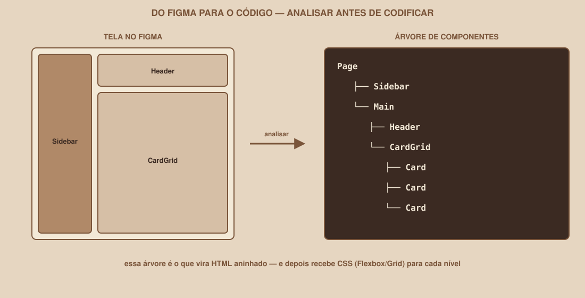

# Módulo 09 — Do Figma para o Código

`SEM 02 // Interface Web — Parte 1: Layout`

---

## // Por que este módulo existe

Você já sabe HTML, CSS, Flexbox, Grid e responsividade — as ferramentas. O que ainda falta é o raciocínio que conecta uma tela do Figma ao código: como olhar para um design e decidir, antes de escrever qualquer tag, quais elementos existem e como eles se organizam.

Pular essa análise é a causa mais comum de HTML bagunçado — quem começa direto pelo código tende a criar estrutura ad-hoc, sem hierarquia clara, e descobre os problemas só depois, quando já é mais caro corrigir.

## // Analisando antes de codificar

Pegue a tela de Dashboard do seu protótipo no Figma (ou a referência visual deste guia, se ainda não tiver a sua). Antes de abrir o editor de código, pergunte: **quais grandes regiões existem aqui?**

```text
┌──────── Sidebar ────────┐
│                         │
│                         │
└─────────────────────────┘

┌──────────── Main ──────────────┐
│ Header                         │
│                                │
│ Cards                          │
│                                │
└────────────────────────────────┘
```

Nesse ponto, você ainda não está pensando em HTML — só em regiões. Duas grandes áreas: uma barra lateral e uma área principal, que por sua vez tem um cabeçalho e uma grade de cards dentro dela.

## // Decompondo em árvore

O próximo passo é transformar essas regiões em uma hierarquia — exatamente a relação pai/filho que você aprendeu no Módulo 02:

<div align="center">

</div>

```text
Page
├── Sidebar
└── Main
    ├── Header
    └── CardGrid
        ├── Card
        ├── Card
        └── Card
```

Essa árvore **é** o HTML, só ainda não escrito com tags:

```html
<div class="page">
  <aside class="sidebar">...</aside>
  <main>
    <header>...</header>
    <div class="card-grid">
      <div class="card">...</div>
      <div class="card">...</div>
      <div class="card">...</div>
    </div>
  </main>
</div>
```

Repare que a estrutura HTML segue exatamente a árvore que você desenhou — cada nível de aninhamento corresponde a um nível da árvore. Depois de ter essa estrutura, o CSS entra: Flexbox ou Grid para `.page` (organizando sidebar e main), Grid para `.card-grid`, Flexbox para o conteúdo dentro de cada `.card`.

## // O que NÃO fazer: copiar coordenadas

O Figma mostra a posição exata de cada elemento em pixels (X, Y). É tentador tentar replicar essa posição exata no CSS:

```css
/* NÃO FAÇA ISSO */
.card {
    position: absolute;
    top: 120px;
    left: 340px;
}
```

> **POR QUE EVITAR `POSITION: ABSOLUTE` PARA MONTAR A PÁGINA INTEIRA**
> Posicionamento absoluto tira o elemento do fluxo normal da página — ele para de reagir ao conteúdo ao redor, ao tamanho da tela, a qualquer coisa. Um layout construído inteiramente com coordenadas fixas quebra no primeiro tamanho de tela diferente daquele em que foi medido. É o oposto do que Flexbox e Grid foram desenhados para resolver: layout que se adapta, não que se fixa.

Isso não significa que `position: absolute` nunca serve para nada — ele tem usos legítimos e pontuais (um badge no canto de um avatar, por exemplo). O problema é usá-lo como estratégia *principal* para montar a página inteira, tentando replicar coordenadas do Figma uma a uma.

## // O processo, resumido

1. **Olhe a tela inteira** e identifique as grandes regiões (2 a 4 blocos principais, geralmente).
2. **Desenhe a árvore** — quem é filho de quem.
3. **Escreva o HTML** seguindo exatamente essa árvore, usando tags semânticas onde fizer sentido.
4. **Decida a ferramenta de layout** para cada nível — Flexbox para sequências em uma direção, Grid para estruturas bidimensionais.
5. **Só então** ajuste espaçamento, cores e detalhes finos.

## // Exemplo guiado: analisando o Perfil

Aplique o mesmo processo à tela de Perfil:

```text
Profile
├── Header (com navegação, igual às outras telas)
└── Main
    ├── Avatar
    ├── UserInfo (nome, e-mail)
    └── Actions (botões)
```

Pergunta antes de codificar: `Avatar`, `UserInfo` e `Actions` deveriam ficar em coluna, ou lado a lado? Essa decisão vem do design da tela — e determina se `Main` usa `flex-direction: column` ou `row`.

## // Erros comuns

| Erro | Por que acontece | Como corrigir |
|---|---|---|
| Pular a análise e abrir o editor direto | Parece mais rápido | Sem a árvore, é comum reescrever a estrutura várias vezes no meio do caminho |
| Tentar replicar posição em pixels do Figma | O Figma mostra números exatos, parece "mais preciso" | Pense em regiões e relações, não em coordenadas |
| Uma árvore com muitos níveis desnecessários | "Embrulhar" tudo em divs extras por precaução | Cada nível da árvore deveria representar uma região real da tela, não uma div vazia |

## // Prática guiada

1. Abra o protótipo do Dashboard no Figma (ou a referência deste guia).
2. No papel ou em um editor de texto simples, desenhe a árvore de componentes, como no exemplo desta seção.
3. Compare sua árvore com o HTML que você já escreveu nos módulos anteriores — eles combinam? Se não, ajuste a estrutura antes de seguir.

## // Pratique sozinho

> **DESAFIO**
> Desenhe a árvore de componentes da tela de Login, incluindo o formulário. Depois, compare com o `login.html` que você já tem — existe alguma região que ficou sem uma tag clara representando ela (por exemplo, o formulário inteiro sem um container em volta)?

## // Aplicando no projeto da semana

1. Desenhe a árvore de componentes das três telas do seu projeto, a partir do Figma da Semana 01.
2. Revise o HTML de cada tela, confirmando que a estrutura de tags corresponde à árvore desenhada.
3. Ajuste qualquer trecho que tenha `position: absolute` sendo usado para montar o layout principal — substitua por Flexbox ou Grid.
4. Commit: `git commit -m "Revisa estrutura HTML das três telas com base na análise do Figma"`.

## // Checkpoint

> **ANTES DE SEGUIR, PENSE NISTO**
> Por que desenhar a árvore de componentes *antes* de escrever HTML economiza tempo, em vez de ser um passo a mais?

Resposta: porque decisões de estrutura (o que é filho de quê, quais regiões existem) são mais baratas de mudar no papel do que depois de várias linhas de HTML e CSS já escritas em cima de uma estrutura errada. A árvore funciona como um rascunho rápido que evita retrabalho.

## // Resumo do módulo

- [ ] Sei decompor uma tela em regiões antes de escrever qualquer tag.
- [ ] Sei transformar essas regiões em uma árvore de pai/filho.
- [ ] Sei por que `position: absolute` não deveria montar a página inteira.
- [ ] Já desenhei a árvore de componentes das três telas do meu projeto.

---

**Próximo módulo:** `10-tailwind.md` — agora que CSS está sólido, uma forma mais rápida de escrever as mesmas regras.

`Material de Estudo // Coffee & Code`
