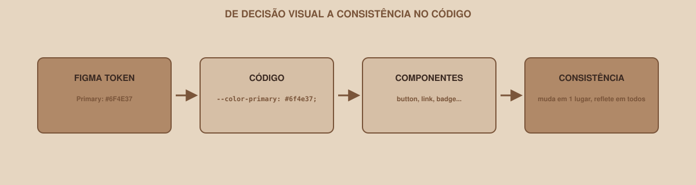

# Módulo 11 — Design System em Código

`SEM 02 // Interface Web — Parte 1: Layout`

---

## // Antes de começar

Volte ao arquivo `/docs/design-system.md` que você criou na Semana 01. Ele tem cores, tipografia e espaçamento documentados — mas, até este módulo, nada disso existe de verdade no seu CSS. Cada cor que você aplicou nos módulos anteriores foi digitada manualmente, correndo o risco de sair um pouco diferente em cada lugar. Este módulo fecha essa lacuna.

## // O problema, de novo

Você já viu essa ideia na Semana 01: cinco pessoas, cinco variações levemente diferentes da "mesma" cor primária, porque cada uma digitou o hex de memória. O mesmo risco existe em código:

```css
.botao-primario { background-color: #6f4e37; }
.link { color: #6f4e37; }
.card-destaque { border-color: #6f4e38; } /* reparou o erro de digitação? */
```

Um dígito errado, e a "mesma" cor já não é mais a mesma.

## // CSS Custom Properties (variáveis do CSS)

> **CSS CUSTOM PROPERTIES — EM PALAVRAS SIMPLES**
> São variáveis reais dentro do CSS — você define um valor uma vez, dá um nome a ele, e reutiliza esse nome em qualquer lugar do arquivo. Mudar o valor na definição muda automaticamente em todo lugar que usa aquele nome.

```css
:root {
    --color-primary: #6f4e37;
    --color-background: #f7f2ed;
    --color-text: #241c18;
}
```

`:root` é o elemento mais alto da página — declarar variáveis ali as torna disponíveis em qualquer seletor do arquivo inteiro. O prefixo `--` identifica que aquilo é uma custom property, não uma propriedade CSS nativa.

### > Usando a variável

```css
.botao-primario {
    background-color: var(--color-primary);
}

.link {
    color: var(--color-primary);
}
```

`var(--color-primary)` busca o valor definido em `:root`. Agora existe **um único lugar** para mudar a cor primária do projeto inteiro.

## // Do Figma ao código, o caminho completo

<div align="center">

</div>

```text
FIGMA TOKEN          Primary: #6F4E37
      ↓
CÓDIGO               --color-primary: #6f4e37;
      ↓
COMPONENTES           button, link, badge... usam var(--color-primary)
      ↓
CONSISTÊNCIA          muda em 1 lugar, reflete em todos
```

## // Transportando o design system inteiro

Retome `/docs/design-system.md` da Semana 01 e transforme cada decisão em uma variável:

```css
:root {
    /* Cores */
    --color-primary: #6f4e37;
    --color-background: #f7f2ed;
    --color-text: #241c18;
    --color-error: #b3261e;

    /* Tipografia */
    --font-family-base: 'Inter', sans-serif;
    --font-size-base: 1rem;
    --font-size-heading: 1.75rem;
    --line-height-base: 1.5;

    /* Spacing */
    --spacing-xs: 4px;
    --spacing-sm: 8px;
    --spacing-md: 16px;
    --spacing-lg: 24px;

    /* Radius */
    --radius-md: 8px;
}
```

## // Aplicando em componentes reutilizáveis

### > Botão

```css
.botao-primario {
    background-color: var(--color-primary);
    color: white;
    padding: var(--spacing-sm) var(--spacing-md);
    border-radius: var(--radius-md);
    border: none;
}
```

### > Input

```css
input {
    padding: var(--spacing-sm);
    border-radius: var(--radius-md);
    font-family: var(--font-family-base);
}
```

### > Card

```css
.card {
    padding: var(--spacing-md);
    border-radius: var(--radius-md);
    background-color: white;
}
```

Repare: nenhum valor solto (`#6f4e37`, `16px`) aparece diretamente nesses componentes — tudo referencia uma variável central.

## // Estados: além do padrão

Um design system maduro não define só a aparência "normal" de um componente — define também como ele se comporta em diferentes estados:

| Estado | Quando acontece | Exemplo de regra |
|---|---|---|
| `default` | Estado normal, sem interação | `.botao-primario { ... }` |
| `:hover` | Mouse sobre o elemento | `.botao-primario:hover { background-color: ...; }` |
| `:focus` | Elemento focado via teclado | `.botao-primario:focus { outline: ...; }` — aprofundamos no Módulo 12 |
| `:disabled` | Elemento desabilitado | `.botao-primario:disabled { opacity: 0.5; }` |
| erro | Campo de formulário com valor inválido | Geralmente uma classe adicional, como `.input-erro` |
| sucesso, quando pertinente | Confirmação de uma ação | Geralmente uma classe adicional, como `.mensagem-sucesso` |

Você não precisa implementar todos esses estados nesta semana — mas vale documentá-los, mesmo que como pendência, para não esquecer que eles existem.

## // Erros comuns

| Erro | Por que acontece | Como corrigir |
|---|---|---|
| Misturar variáveis com valores soltos | Esquecer de usar `var()` em algum lugar | Revise: nenhuma cor ou espaçamento do design system deveria aparecer como valor literal fora de `:root` |
| Nome de variável pouco claro (`--cor1`, `--tam2`) | Pressa ao criar | Nomeie pela função (`--color-primary`), não pela aparência (`--cor-marrom`) — a função se mantém mesmo se a cor mudar |
| Esquecer de atualizar `/docs/design-system.md` depois de criar as variáveis | O documento e o código ficam dessincronizados | Trate o arquivo de documentação como parte do trabalho, não como extra opcional |

## // Prática guiada

1. Crie o bloco `:root` no topo do seu `styles.css`, com as variáveis de cor, tipografia e spacing do seu design system da Semana 01.
2. Substitua os valores soltos que você usou nos módulos anteriores (nos botões, cards, formulário) por `var(--nome-da-variavel)`.
3. Teste: mude o valor de `--color-primary` em `:root` e confirme visualmente que todos os componentes que usam essa cor mudam juntos.

## // Pratique sozinho

> **DESAFIO**
> Adicione uma variável `--spacing-xl` que ainda não existe no seu design system, decida um valor consistente com a escala existente (por exemplo, se sua escala é 4/8/16/24, o próximo passo lógico seria 32 ou 40), e use ela em algum espaçamento maior do seu projeto, como a distância entre seções do Dashboard.

## // Aplicando no projeto da semana

1. Todas as cores, tipografia e espaçamentos do projeto devem vir de variáveis em `:root`.
2. Atualize `/docs/design-system.md`, adicionando a seção de implementação (veja o modelo abaixo).
3. Commit: `git commit -m "Transporta design system para CSS Custom Properties"`.

Modelo sugerido para adicionar em `/docs/design-system.md`:

```markdown
## Implementação Web

### Cores

| Token | Valor | Uso |
|---|---|---|
| --color-primary | #6f4e37 | ações principais |
| --color-background | #f7f2ed | fundo |
| --color-text | #241c18 | texto |

### Espaçamento

- xs: 4px
- sm: 8px
- md: 16px
- lg: 24px

### Componentes implementados

- Button
- Input
- Card
- Navbar
```

## // Checkpoint

> **ANTES DE SEGUIR, PENSE NISTO**
> Sua equipe decide mudar a cor primária do projeto inteiro. Com CSS Custom Properties bem aplicadas, quantos lugares no código precisam ser editados?

Resposta: um só — a definição da variável dentro de `:root`. Todo componente que usa `var(--color-primary)` reflete a mudança automaticamente, sem precisar editar cada regra individualmente.

## // Resumo do módulo

- [ ] Sei o que são CSS Custom Properties e como declará-las em `:root`.
- [ ] Sei usar `var()` para aplicar uma variável em qualquer regra.
- [ ] Transportei cores, tipografia e spacing do meu design system da Semana 01 para variáveis reais.
- [ ] Sei listar os estados que um componente pode ter, além do padrão.
- [ ] Atualizei `/docs/design-system.md` com a seção de implementação.

---

**Próximo módulo:** `12-acessibilidade.md` — seu projeto funciona para você. Vamos garantir que funcione para mais gente.

`Material de Estudo // Coffee & Code`
