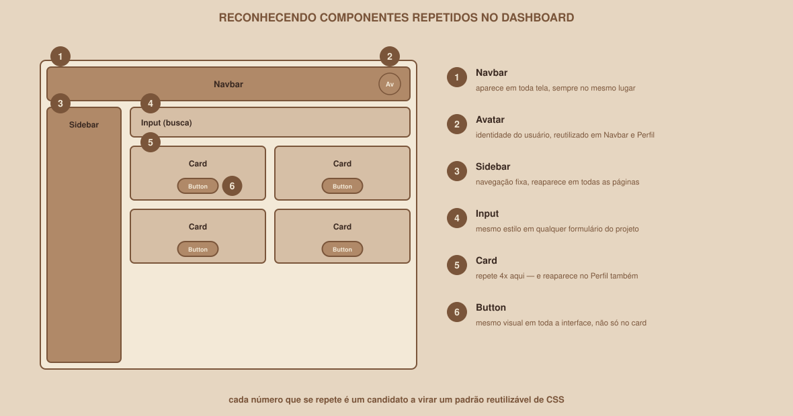

# Módulo 13 — Componentização e Temas

`SEM 02 // Interface Web — Parte 1: Layout`

---

## // O problema

Olhe para o seu próprio CSS neste ponto da semana. É provável que você tenha escrito a mesma regra de botão mais de uma vez:

```html
<button class="...">Salvar</button>
<button class="...">Entrar</button>
<button class="...">Editar</button>
```

Cada botão, reescrito do zero, corre o risco de sair levemente diferente — um com `padding: 12px`, outro com `padding: 10px 14px`, sem ninguém decidir isso conscientemente.

## // Pensamento em componentes

> **COMPONENTIZAÇÃO — EM PALAVRAS SIMPLES**
> É reconhecer que um pedaço de interface se repete, e tratar ele como uma unidade reutilizável — uma classe, um padrão — em vez de recriar do zero toda vez que aparece.

Nesta semana, sem usar nenhum framework de componentes (React entra em semanas futuras do clube), "componentizar" significa: identificar padrões repetidos e reutilizar classes CSS consistentes para eles.

<div align="center">

</div>

No seu próprio Dashboard, é bem provável que existam pelo menos estes padrões repetidos:

- **Navbar** — aparece em toda tela.
- **Card** — se repete várias vezes no grid, e talvez reapareça no Perfil.
- **Button** — usado em Login, Dashboard e Perfil.
- **Input** — usado no formulário de Login, e talvez em uma busca do Dashboard.
- **Avatar** — reutilizado em Navbar e Perfil.

## // Se você está começando

O objetivo, neste nível, é simples: identifique os componentes repetidos do seu projeto, e garanta que cada um usa a **mesma classe CSS** em todo lugar que aparece.

```css
.botao-primario {
    background-color: var(--color-primary);
    color: white;
    padding: var(--spacing-sm) var(--spacing-md);
    border-radius: var(--radius-md);
}
```

```html
<button class="botao-primario">Salvar</button>
<button class="botao-primario">Entrar</button>
<button class="botao-primario">Editar</button>
```

Três botões, uma única definição. Se você precisar mudar o visual do botão primário, muda em um lugar, reflete nos três.

## // Se você já tem experiência

### > Organização de estilos

Um `styles.css` único cresce rápido e vira difícil de navegar. Uma organização comum, sem precisar de nenhuma ferramenta de build:

```text
css/
├── base.css          /* reset, tipografia base, :root com as variáveis */
├── components.css    /* .botao-primario, .card, .input, .navbar */
├── layout.css        /* .dashboard-grid, estrutura geral das páginas */
└── utilities.css      /* classes pequenas e reutilizáveis, se precisar */
```

Cada arquivo é conectado com seu próprio `<link>`, ou combinados via `@import` no topo de um arquivo principal.

### > Composição em vez de duplicação

```css
.botao-base {
    padding: var(--spacing-sm) var(--spacing-md);
    border-radius: var(--radius-md);
    border: none;
    font-family: var(--font-family-base);
}

.botao-primario {
    background-color: var(--color-primary);
    color: white;
}

.botao-secundario {
    background-color: transparent;
    color: var(--color-primary);
    border: 1px solid var(--color-primary);
}
```

```html
<button class="botao-base botao-primario">Entrar</button>
<button class="botao-base botao-secundario">Cancelar</button>
```

`botao-base` carrega o que é comum a qualquer botão; `botao-primario`/`botao-secundario` carregam só a diferença. Isso evita repetir `padding` e `border-radius` em cada variação.

### > Separação entre estrutura e apresentação

Evite nomear classes pela aparência (`.texto-azul`, `.caixa-grande`) — prefira nomear pela função (`.titulo-secao`, `.card-destaque`). Se a cor "azul" mudar para outra no futuro, uma classe chamada `.texto-azul` fica com um nome que não corresponde mais à realidade.

## // Tema claro/escuro

> **NÃO COMECE PELO CÓDIGO**
> Antes de qualquer CSS, pergunte: o que muda entre o tema claro e o escuro, no seu projeto? Normalmente, a resposta é: cores e tokens — não a estrutura, não o layout, não os componentes em si.

Usando as CSS Custom Properties que você já criou no Módulo 11:

```css
:root {
    --bg: #ffffff;
    --text: #181818;
}

[data-theme="dark"] {
    --bg: #181818;
    --text: #ffffff;
}
```

```css
body {
    background-color: var(--bg);
    color: var(--text);
}
```

O truque está em `[data-theme="dark"]` — um seletor de atributo, que sobrescreve as variáveis de `:root` quando o elemento (geralmente o `<html>` ou `<body>`) tem o atributo `data-theme="dark"`:

```html
<html data-theme="dark">
```

Todo componente que já usa `var(--bg)` ou `var(--text)` muda automaticamente de tema — sem precisar de uma segunda versão de cada regra.

### > `prefers-color-scheme`

```css
@media (prefers-color-scheme: dark) {
    :root {
        --bg: #181818;
        --text: #ffffff;
    }
}
```

Essa media query detecta a preferência de tema já configurada no sistema operacional da pessoa (muitos celulares e computadores têm essa opção). Você pode usar ela como padrão automático, e ainda combinar com `data-theme` para permitir que a pessoa troque manualmente dentro do seu site.

> **IMPORTANTE — SEM VIRAR AULA DE JAVASCRIPT**
> Um botão que troca o tema ao ser clicado exige JavaScript para alternar o atributo `data-theme` dinamicamente. Isso não é foco desta semana. O CSS acima já é suficiente para o entregável básico (usando `prefers-color-scheme`, o tema muda automaticamente com a configuração do sistema). Um botão de troca manual de tema é um desafio extra, marcado especificamente para veteranos.

## // Erros comuns

| Erro | Por que acontece | Como corrigir |
|---|---|---|
| Reescrever o mesmo componente várias vezes | Não parar para notar o padrão repetido | Pergunte, a cada novo elemento: "estou recriando algo que já existe?" |
| Nomear classe pela aparência, não pela função | Parece mais direto no momento | Nomeie pelo papel (`.card-destaque`), não pela cor/tamanho atual |
| Tentar implementar troca de tema com JavaScript antes do CSS estar pronto | Empolgação em ir além | Garanta primeiro que as variáveis de tema cobrem tudo; JavaScript é só o gatilho depois |

## // Prática guiada

1. Liste, em texto mesmo, todos os componentes que se repetem no seu projeto (Navbar, Card, Button, Input, Avatar — ajuste para o que existir no seu caso).
2. Para cada um, confirme: existe uma única classe CSS reutilizada em todo lugar que ele aparece? Se não, unifique.
3. Adicione o bloco `[data-theme="dark"]` ao seu `styles.css`, com pelo menos `--bg` e `--text` redefinidos.
4. Adicione `<html data-theme="dark">` temporariamente só para testar visualmente a troca — depois volte para `data-theme="light"` ou remova o atributo.

## // Pratique sozinho

> **DESAFIO**
> Adicione a media query `prefers-color-scheme: dark`, fazendo o tema escuro ativar automaticamente quando o sistema da pessoa estiver configurado para isso. Teste mudando a configuração de tema do seu próprio sistema operacional (a maioria tem essa opção em Ajustes/Configurações) e recarregando a página.

## // Aplicando no projeto da semana

1. Confirme que Button, Card, Input e Navbar usam uma única classe CSS reutilizada, consistente nas três telas.
2. Adicione suporte a tema claro/escuro via `data-theme` e/ou `prefers-color-scheme`, cobrindo pelo menos cor de fundo e cor de texto.
3. Commit: `git commit -m "Consolida componentes reutilizáveis e adiciona suporte a tema escuro"`.

## // Checkpoint

> **ANTES DE SEGUIR, PENSE NISTO**
> Sua equipe quer adicionar um botão que alterna entre tema claro e escuro ao ser clicado. O CSS que você já escreveu neste módulo já é suficiente para isso funcionar, ou falta alguma coisa?

Resposta: falta JavaScript. O CSS já prepara toda a base (as variáveis mudando conforme `data-theme`), mas alternar esse atributo em resposta a um clique é uma ação dinâmica — comportamento, não estrutura nem apresentação — que só JavaScript resolve. É exatamente por isso que esse botão está marcado como desafio de aprofundamento, não como parte do entregável básico.

## // Resumo do módulo

- [ ] Sei identificar componentes repetidos no meu próprio projeto.
- [ ] Sei reutilizar uma única classe CSS para cada componente, em vez de recriar cada instância.
- [ ] Sei separar estilos em arquivos organizados, e compor classes base + variação.
- [ ] Sei implementar tema claro/escuro via CSS Custom Properties e `data-theme` ou `prefers-color-scheme`.
- [ ] Sei por que um botão de troca de tema manual precisa de JavaScript, e por que isso fica como desafio extra.

---

**Próximo módulo:** `14-projeto-guiado.md` — juntando tudo, do início ao fim, nas três telas completas.

`Material de Estudo // Coffee & Code`
